### Link Folder Project berada pada repository berikut:  
https://github.com/triyanadewi/-05-website-pribadi-nextjs

---

# Laporan Praktikum Membuat Halaman yang SEO-Friendly dengan Next.js

|  | Pemrograman Berbasis Framework 2025 |
|--|--|
| NIM |  2241720206 |
| Nama |  Triyana Dewi Fatmawati |
| Kelas | TI - 3D |

## Langkah-langkah Praktikum
### 1. Memahami Pentingnya SEO
SEO (Search Engine Optimization) adalah praktik mengoptimalkan website agar mudah ditemukan oleh mesin pencari seperti Google. Dengan SEO yang baik, website Anda akan lebih mudah muncul di hasil 
pencarian, sehingga meningkatkan traffic pengunjung.  
Beberapa elemen penting dalam SEO: 
- Title Tag: Judul halaman yang muncul di hasil pencarian. 
- Meta Description: Deskripsi singkat tentang halaman. 
- Heading Tags (H1, H2, dll.): Struktur konten yang membantu mesin pencari memahami isi halaman. 
- URL Structure: URL yang deskriptif dan mudah dibaca. 
- Open Graph Tags: Metadata untuk media sosial seperti Facebook dan Twitter. 
- Favicon: Ikon kecil yang muncul di tab browser. 

---

### 2. Menambahkan Favicon 
Favicon adalah ikon kecil yang muncul di tab browser dan bookmark. Favicon membantu meningkatkan identitas brand website Anda.   
**Langkah-langkah:**
1. Siapkan file favicon (format .ico) dan letakkan di folder public/.
2. Hapus faveicon.ico yang ada di folder src/app  
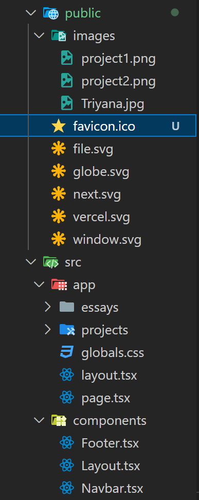

3. Update file src/components/layout.tsx untuk menambahkan favicon:  
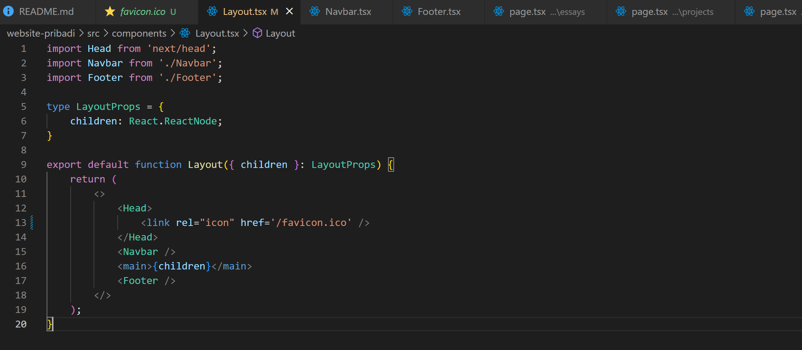

4. Simpan dan jalankan proyek. Favicon akan muncul di tab browser.  
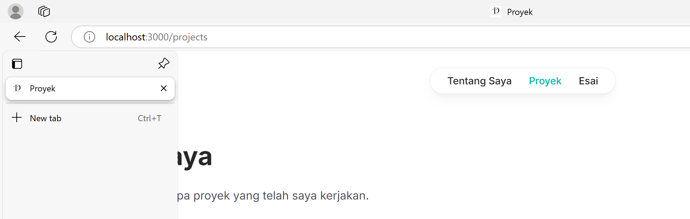
---

### 3. Menambahkan Metadata untuk SEO 
Metadata seperti title dan description sangat penting untuk SEO. Metadata ini akan muncul di hasil pencarian dan membantu mesin pencari memahami konten halaman.  
**Langkah-langkah:** 
1. Buat file src/utils/metadata.ts untuk menyimpan metadata default:  
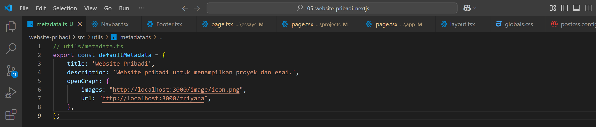

2. Update file src/components/layout.tsx untuk menggunakan metadata default jika tidak ada metadata yang di-pass:  
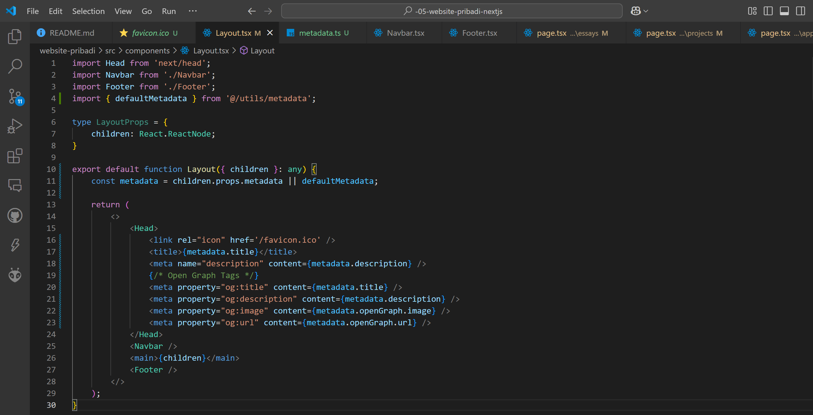

3. Update Setiap Halaman untuk dapat mem-pass definisi metadata, Halaman Tentang Saya:  
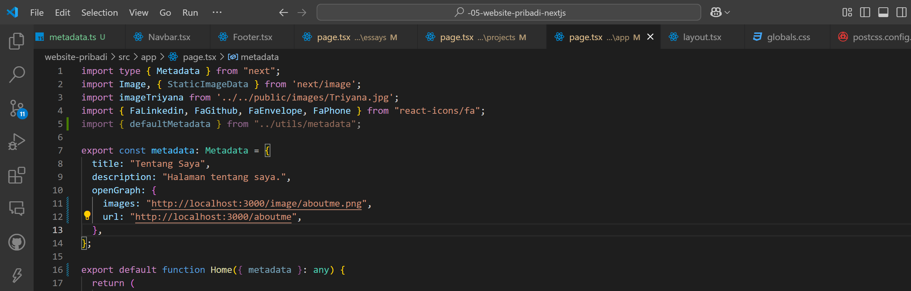

4. Lanjutkan untuk halaman Proyek dan Esai  
Halaman Proyek:  
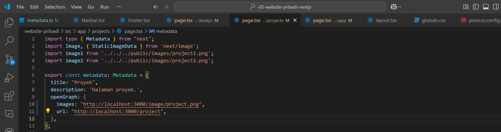  
Halaman Esai:  
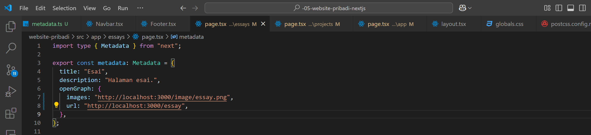
---

### 4. Open Graph Tags untuk Media Sosial 
Open Graph Tags digunakan untuk mengontrol bagaimana konten Anda ditampilkan saat dibagikan di media sosial seperti Facebook dan Twitter.  
**Langkah-langkah:** 
1. Pastikan Anda telah menambahkan Open Graph Tags di layout.tsx seperti yang telah dijelaskan sebelumnya. 
2. Update metadata di setiap halaman untuk menyertakan Open Graph Tags.

---

### 5. Menguji SEO 
Setelah menambahkan metadata, favicon, dan Open Graph Tags, Anda dapat menguji SEO dengan Membuka halaman di browser dan memeriksa elemen HTML menggunakan Developer Tools (Ctrl + Shift + I atau F12).
1. Halaman Tentang Saya  
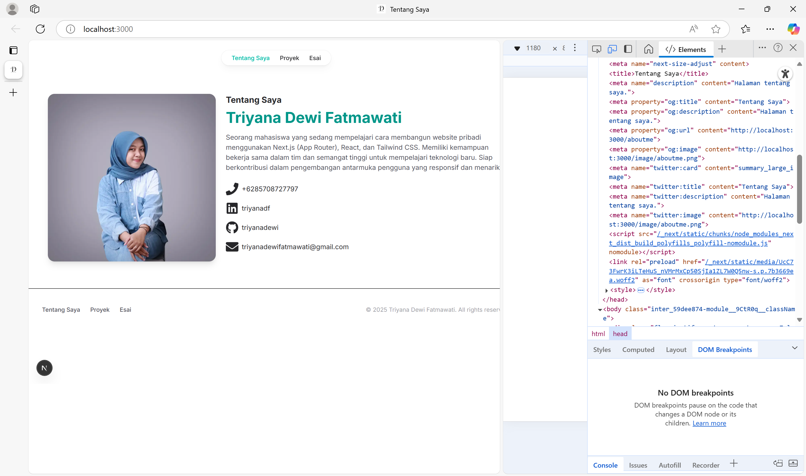

2. Halaman Proyek  
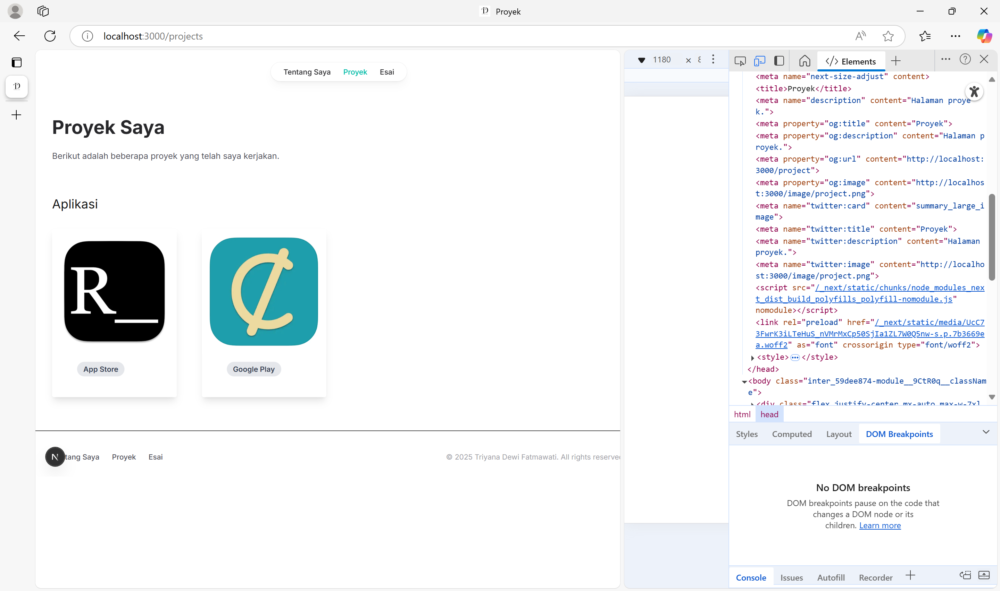

3. Halaman Esai  
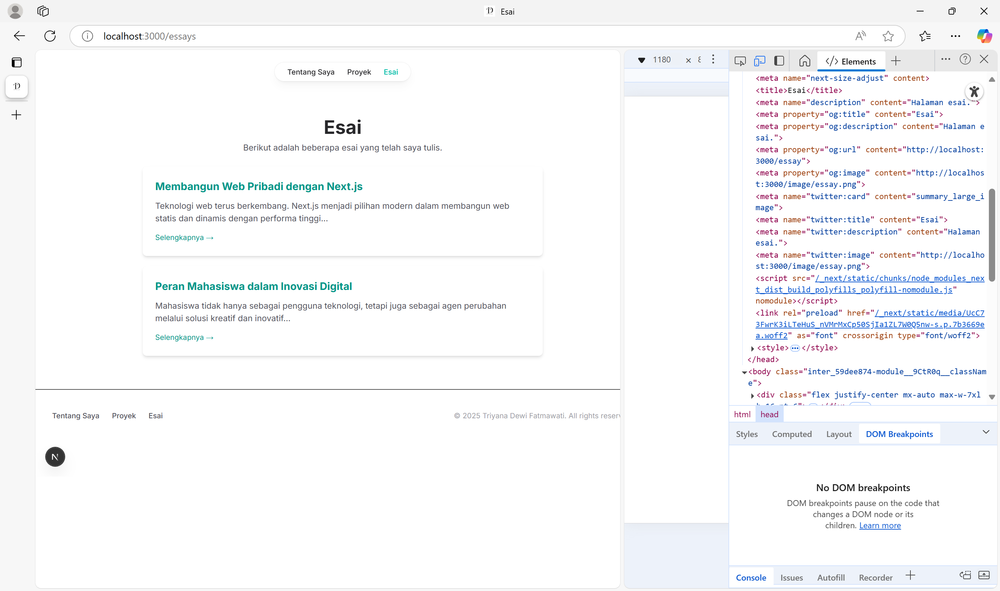

---

## Tugas 
Lakukan pengujian SEO dengan Gunakan tools seperti Google Search Console untuk memeriksa performa SEO dari suatu website. 
### Jawaban:  
#### **1. Website Pribadi menggunakan Google Search Console**
Saya telah menggunakan Google Search Console untuk memeriksa performa SEO dari website pribadi saya:
https://05-website-pribadi-nextjs-triyana.vercel.app
 

**Hasil Pemeriksaan:**  
- Verifikasi Properti Berhasil  
Website telah diverifikasi menggunakan metode file HTML. 

- Laporan Performa
Tampilan performa di Google Search Console masih kosong karena website baru saja didaftarkan. 
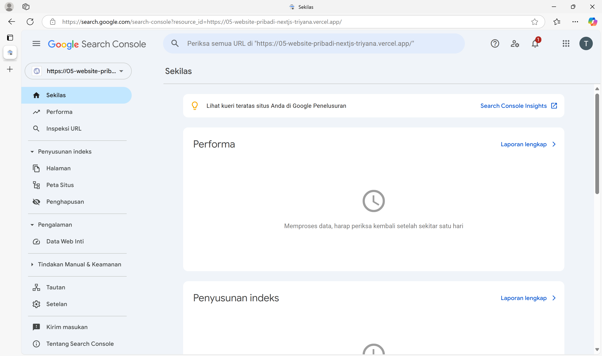

#### **2. Website tokopedia.com menggunakan Ubersuggest**
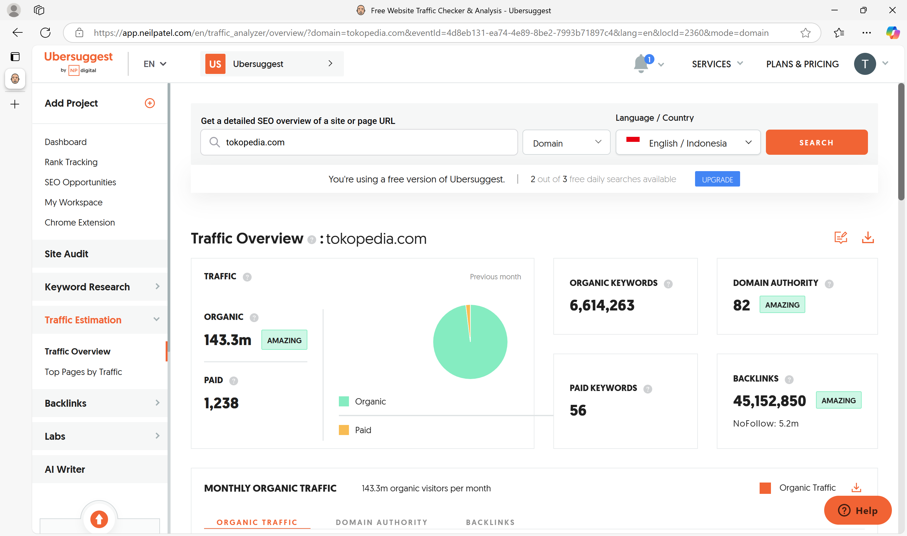
**Hasil Pemeriksaan:**  
**Traffic Overview  **
- Organic Traffic: 143.3 juta / bulan :
Artinya, jumlah pengunjung yang datang ke situs Tokopedia melalui hasil pencarian organik (tidak berbayar) sangat besar.
- Paid Traffic: 1,238 : 
Ini adalah jumlah pengunjung yang datang dari iklan berbayar (seperti Google Ads), relatif sangat kecil dibanding trafik organik.

**Keyword Overview**  
- Organic Keywords: 6,614,263 :
Tokopedia muncul di hasil pencarian Google untuk lebih dari 6 juta kata kunci unik.
- Paid Keywords: 56 :
Hanya 56 kata kunci yang digunakan untuk iklan.

**Domain Authority: 82**  
- Skor dari 1–100 yang menunjukkan seberapa kuat otoritas domain suatu situs.
- Nilai 82 berarti sangat kuat dan berpeluang tinggi muncul di halaman pertama Google.

**Backlinks: 45,152,850**  
- Jumlah backlink (tautan dari situs lain ke Tokopedia.com), termasuk: 5,2 juta di antaranya merupakan backlink NoFollow (tidak mewariskan otoritas).
- Backlink sangat penting dalam SEO karena berfungsi sebagai “vote of trust” dari situs lain.

---

## Kesimpulan 
Dalam praktikum ini, Anda telah mempelajari cara membuat halaman Next.js yang SEO-friendly dengan menambahkan metadata, favicon, dan Open Graph Tags. Dengan teknik ini, website Anda akan lebih mudah ditemukan oleh mesin pencari dan menarik lebih banyak pengunjung. 